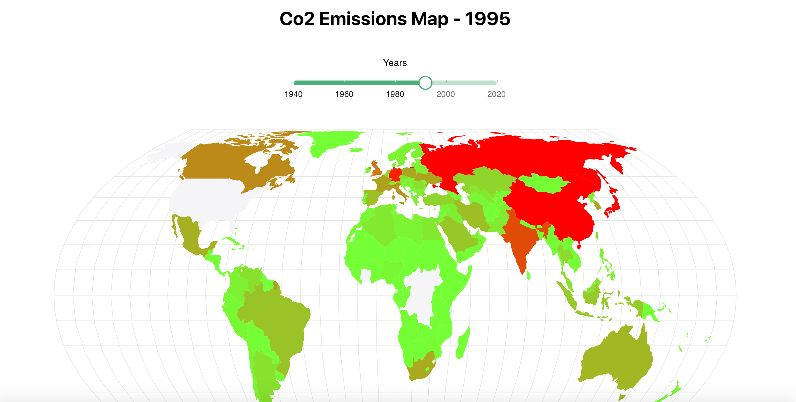
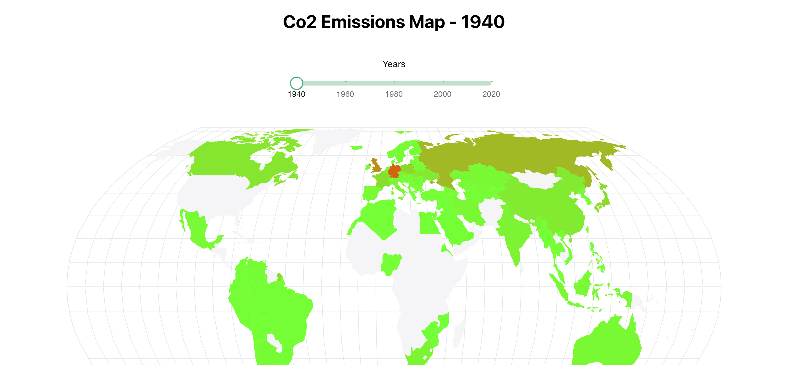
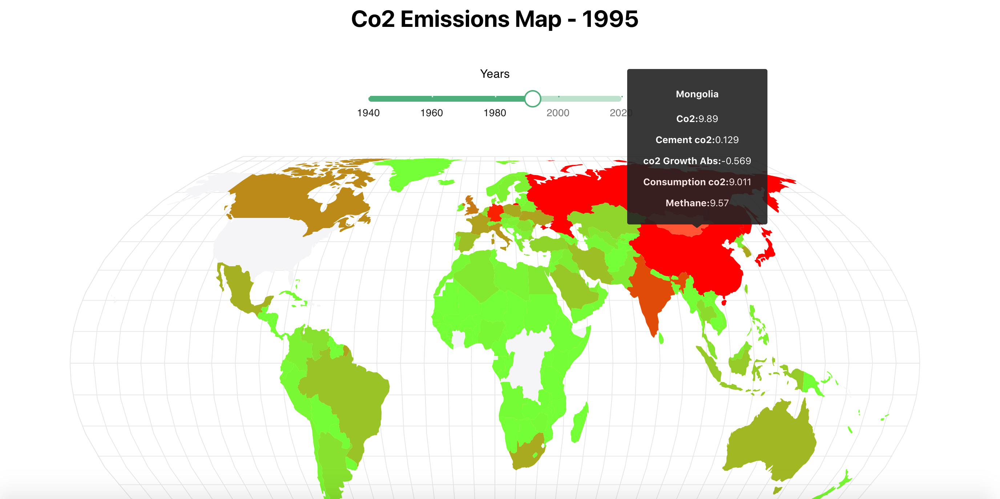

# Co2 Emissions Map App

This project was build with React JS, MaterialUI, React Simple Maps.

## Project Screen Shot(s)





## Project setup
Clone down this repository. You will need node and npm installed globally on your machine.

Installation:
```bash
npm install
```

To Start Server:
```bash
npm start
```

To Run Test Suite:
```bash
npm test
```
To Visit App:
```bash
localhost:3000
```